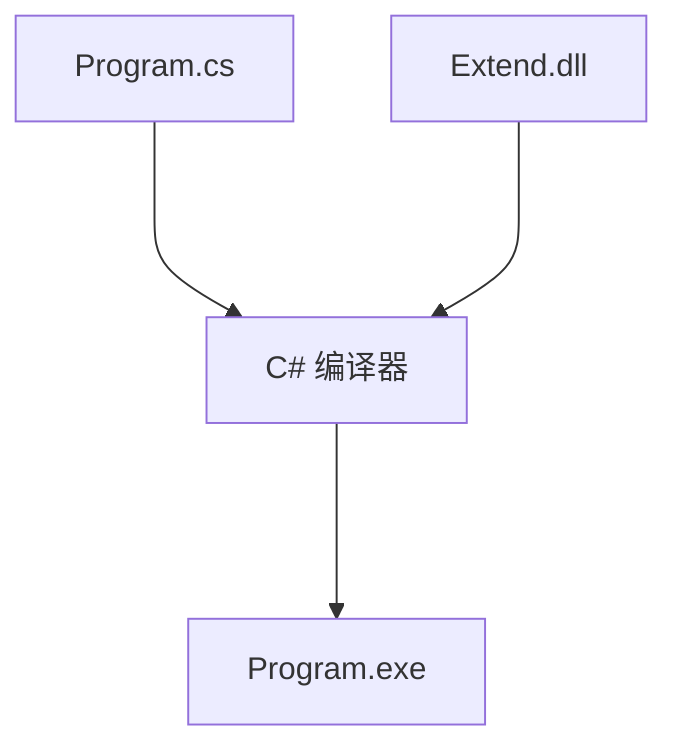

# C# 程序集加载

## 1. 静态加载

C# 的常用 IDE 如 Visual Studio，Rider 是以解决方案（Solution）来管理项目的（Project）。

不同的项目可以是 Console Application（命令行程序），Desktop Application（窗口程序），Class Library（DLL）等。

当一个项目需要使用 DLL 时，可以设置 Reference（引用关系）来使用 DLL 中的类和方法。

### 1.1 使用 Solution 内部的 DLL

下面以一个 Solution 来举例。结构如下：

```
- Test
- ConsoleApp (Console Application)
  - Program.cs
 - Extend     (Class Library)
  - Vector2.cs
```

在 Extend 中我们定义了一个 Vector2 的结构体

```csharp
// Vector2.cs

namespace Extend
{
    public struct Vector2
    {
        public float x;
        public float y;

        public Vector2(float x, float y)
        {
            this.x = x;
            this.y = y;
        }

        public static Vector2 operator + (Vector2 a, Vector2 b) => new(a.x + b.x, a.y + b.y);

        public override string ToString() => $"({x},{y})";
    }
}
```

Extend 通过编译后会变成 Extend.dll，当我们需要在 ConsoleApp 中使用 Extend 中的 Vector2 时，可以通过直解设置 Reference 到 Extend。

在 IDE 中找到 ConsoleApp ，右键菜单中通过 Reference 来添加。或者直接修改项目配置文件 ConsoleApp.csproj 如下所示：

```xml
<!--ConsoleApp.csproj-->

<Project Sdk="Microsoft.NET.Sdk">

    <PropertyGroup>
        <OutputType>Exe</OutputType>
        <TargetFramework>net6.0</TargetFramework>
        <ImplicitUsings>enable</ImplicitUsings>
        <Nullable>enable</Nullable>
    </PropertyGroup>

    <ItemGroup>
      <!--添加了对 Extend 的引用-->
      <ProjectReference Include="..\Extend\Extend.csproj" />
    </ItemGroup>

</Project>
```

最后直接在 Program.cs 中使用 Vector2 即可。

```csharp
// Program.cs

using Extend;

namespace ConsoleApp
{
    internal static class Program
    {
        private static void Main()
        {
            var a = new Vector2(1, 2);
            var b = new Vector2(3, 4);
            
            Console.WriteLine((a + b).ToString());
        }
    }
}
```

### 1.2 使用外部 DLL

文件目录如下：

```
- TestDLL
- TestDLL (Console Application)
  - lib
   - Extend.dll
   - Extend.pdb
  - Program.cs
```

这里直接使用 Test 中编译好的 Extend.dll 和对应的 Extend.pdb

> pdb 文件可以帮助我们在 IDE 中直接查看 dll 的源码并且 Debug

然后只需要在 TestDLL 的引用中对 Extend 引用即可。

```xml
<!--TestDLL.csproj-->

<Project Sdk="Microsoft.NET.Sdk">

    <PropertyGroup>
        <OutputType>Exe</OutputType>
        <TargetFramework>net6.0</TargetFramework>
        <ImplicitUsings>enable</ImplicitUsings>
        <Nullable>enable</Nullable>
    </PropertyGroup>

    <ItemGroup>
      <Folder Include="lib\" />
    </ItemGroup>

    <ItemGroup>
      <!--添加了对 Extend 的引用-->
      <Reference Include="Extend">
        <HintPath>lib\Extend.dll</HintPath>
      </Reference>
    </ItemGroup>

</Project>

```

上述两种方式实际上都是在 Program.cs 编译的时候，与 DLL 程序集一起通过 C# 编译器编译为 Program.exe 程序集。




## 2. 动态加载

当我们需要在程序运行时，去加载指定的 DLL 然后调用其中的方法时，就需要用到 C# 的反射了。

文件结构如下：

```
- TestDLL
- TestDLL (Console Application)
  - lib
   - Extend.dll
   - Extend.pdb
  - ProgramDynamicDLL.cs
```

动态加载代码如下：

```csharp
// ProgramDynamicDLL

using System.Reflection;

namespace ConsoleApp;

internal static class ProgramDynamicDll
{
    private static void Main()
    {
        // 加载 Extend.dll 并从中获取 Vector2 的反射信息
        var type = Assembly.LoadFrom(@"..\..\..\lib\Extend.dll").GetType("Extend.Vector2");
            
        if (type != null)
        {
            // Vector2 a = new (1, 2)
            var a = Activator.CreateInstance(type, 1f, 2f);
            // Vector2 b = new (3, 4)
            var b = Activator.CreateInstance(type, 3f, 4f);
            // Vector2 res = a + b
            var res = type.GetMethod("op_Addition")?.Invoke(null, new[] { a, b });
            
            // 此处 null 对应的参数表为空
            Console.WriteLine(type.GetMethod("ToString")?.Invoke(res, null));
        }
    }
}
```


