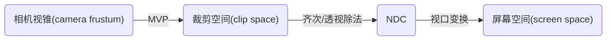

# 光栅化（Rasterize)

做完 MVP（Model，View，Projection），经历 **齐次/透视除法（Homogeneous/Perspective Division）**，即x，y，z都除以 w 分量，就得到了一个正则化的（canonical） $[-1,1]^3$ 的正方体空间，也被称作 **归一化设备空间（Normalized Device Coordinate, NDC）** 。之后便是要将正方体空间中的物体正确的投影到屏幕上。而这一步就叫做 **光栅化（Rasterize）**。

> 光栅（Raster）由像素构成的一个矩形网格。raster 的词源来自拉丁语 rastrum（耙）。
>
> NDC 空间在不同的图形 api 中定义不同，OpenGL 中是 $[-1, 1]^3$ 的立方体，D3D 中是 XY 为 $[-1,1]^2$， Z 为 $[0,1]$。

## 1. 屏幕空间和视口变换 

屏幕空间坐标系有不同的定义方法，在 GAMES101 课程中是按照以下方法定义屏幕空间


定义完屏幕空间，接下来就是要通多视口（viewport）变换矩阵 $\mathbf M_{viewport}$ 将正方体拉伸到视口对应的宽和高，并对齐坐标系，即$[-1,1]^2\to[0,width]\times[0,height]$。具体矩阵如下：
$$
\mathbf M_{viewport}=
\begin{bmatrix}
\frac{width}{2}&0&0&\frac{width}{2}\\
0&\frac{height}{2}&0&\frac{height}{2}\\
0&0&1&0\\
0&0&0&1
\end{bmatrix}
$$
转换完成后，就可以获得二维的图像了，接下来就是要将其和屏幕空间的像素对应起来。

这里，从到到尾捋一遍相机空间的变换和其命名。



前三步可以参考下图


## 2. 三角形网格（Triangle mesh）

在常见的三维建模软件，人们最常使用的是多边形网格（polygon mesh）进行模型的设计，每个网格通常为三角形、四边形或者其他简单凸多边形。而三角形是最基本的多边形，所有多边形都可以被拆解为三角形。此外三角形还有几个独特而且十分有用的特性：

* 三角形所形成的面一定是平的；

* 有明确的的内外之分（可以很容易的判断一个点是否在三角形内）；

* 定义三角形的三个定点属性即可插值出三角形内的所有点属性（质心插值算法)，如下

  * $f=\alpha f_0+\beta f_1+\gamma f_2$ 

    其中 $f,f_0,f_1,f_2$ 分别是插值结果和三个顶点的属性（比如深度，颜色，纹理 uv），$\alpha,\beta,\gamma$ 是重心坐标系数，推导见 [重心坐标系推导](https://blog.ashechol.top/2023/01/06/math/%E9%87%8D%E5%BF%83%E5%9D%90%E6%A0%87%E7%B3%BB/)


基于三角形的这些优点，GPU 渲染管线模型统一变为三角形网格以便后续的操作。

### 2.1 三角形网格的光栅化

为了用显示器的像素点表示出三角形，需要运用到采样（sampling）：采样每个在三角形内部像素点的中心。这样可以类似得到以下的代码

```cpp
for (int x = 0; x < xmax; x++)
    for (int y = 0; y < ymax; y++)
        image[x][y] = inside(tri, x + 0.5, y + 0.5);
```

这里的 `inside` 函数判断像素点的中心是否在三角形内，如果在，则返回 1 ，反之 0。

### 2.2 点是否在三角形内

判断方法有两种，但都涉及到了三次向量叉乘。

**简单方法**

* 按照 **顺时针**/**逆时针 **顺序选取三角形顶点和边，每个顶点所在边的向量叉乘该顶点到判定点 Q 的向量。
  * 如果三个叉乘结果的 z 值都同向（**小于0** / **大于0**），则该点在三角形内。

**重心/质心坐标法（barycentric coordinate）**

任意三个点（$p_0,p_1,p_2$）确定的平面上的任意点 $p$ 其向量都能用以下公式表示：
$$
\boldsymbol p(\alpha,\beta,\gamma)=\alpha\cdot\boldsymbol p_0+\beta\cdot\boldsymbol p_1+\gamma\cdot\boldsymbol p_2
$$
且约束条件为
$$
\alpha+\beta+\gamma=1
$$
若点 $p$ 在三角形内则三个参数（$\alpha,\beta,\gamma$）满足：
$$
0<\alpha,\beta,\gamma<1
$$

此外不难发现，当三个参数中有一个值为 1 时，其余两个参数一定为 0，这表示点 $p$ 与值为 1 参数对应顶点重合。当三个参数仅有一个值为 0 时，公式就退化为线性表示两点连线之间的点。


> 推导见 [重心坐标系推导](https://blog.ashechol.top/2023/01/06/math/%E9%87%8D%E5%BF%83%E5%9D%90%E6%A0%87%E7%B3%BB/)

现今的 GPU 有专门的模块用于处理点在三角形内外的判断。

### 2.3 光栅化计算加速（三角形遍历方法）

一个三角形的所涉及到的区域是能够确定的，所以没有必要从整个视口大小的像素范围遍历。有两个更快的方法

**包围盒遍历（bounding box traversal）**：


包围盒的大小可以定义为：
$$
[\min(x_{p_0},x_{p_1},x_{p_2}),\max({x_{p_0},x_{p_1},x_{p_2})}]\times
[\min(y_{p_0},y_{p_1},y_{p_2}),\max(y_{p_0},y_{p_1},y_{p_2})]
$$
对包围盒内的所有点进行判断

**增量三角遍历（Incremental Triangle Traversal）**


不再使用类似 `inside` 函数判断点是否在三角形内。通过计算三角形边的直线方程，利用直线生成算法布雷森汉姆算法（Bresenham algorithm），可以确定三角形每一行的左边界和右边界。

> 布雷森汉姆算法是基于增量的

**其他方法**

**zig-zag：**


**tiled triangle traversal：**


## 3. 混叠（Aliasing）

**混叠** 在图形学中最常见的表现便是光栅化后图像出现的锯齿（jaggies），混叠也常翻译为 **走样**。在图形学中，它是采样瑕疵（sampling artifacts）中的一种情况。

> 这里 artifact 意指 error，mistake，inaccuracy


在光栅化中，像素的多少决定了我们对一个图形采样率的多少。像素越少采样率越低，最终结果的锯齿就会越严重。简而言之，形成锯齿是由于采样率太低导致的。从信号处理的角度，采样率过低会导致信号在频域上的混叠（aliasing 词源便是这里），最后得到的离散信号便不能很好地模拟原始信号。

> 从信号处理的角度分析可见 [傅里叶变换和信号处理](https://blog.ashechol.top/2023/01/08/math/%E5%82%85%E9%87%8C%E5%8F%B6%E5%8F%98%E6%8D%A2%E5%92%8C%E4%BF%A1%E5%8F%B7%E5%A4%84%E7%90%86/)

## 4. 反走样/抗锯齿（Anti-aliasing）

为了减少锯齿，最简单粗暴的方法就是提高采样率。换一个有更高分辨率的显示器，因此我们可以对于同一个图形采样更多的像素，但是这样开销也非常大。所以我们需要用到 **反走样/抗锯齿** 技术。

### 4.1 先模糊后采样

简单来说，图形被模糊后，其边界信息也随之被模糊，这样再采样便可以减轻锯齿。从[混叠](https://blog.ashechol.top/2023/01/08/math/%E5%82%85%E9%87%8C%E5%8F%B6%E5%8F%98%E6%8D%A2%E5%92%8C%E4%BF%A1%E5%8F%B7%E5%A4%84%E7%90%86/#%E6%B7%B7%E5%8F%A0aliasing)的角度来说，为了满足奈奎斯特率（Nyquist rate）减小被采样的信号本身的范围（减小高频的范围），即可保证在采样率不变的情况下（尽管会丢失部分细节，即模糊），避免混叠。


模糊的方法有很多种（可以参考毛星云大佬写的 [十种图像模糊算法的总结与实现](https://zhuanlan.zhihu.com/p/125744132)）。其中一个非常简单的模糊算法被叫做 **方框模糊（box blur）**。其思想是：每个像素具有的值等于其邻近的像素的输入图像中的平均值。所以也有人将其称作 **均值模糊** 。

方框模糊的 $3\times 3$ 卷积核表示如下：
$$
\frac{1}{9}
\begin{bmatrix}
1&1&1\\
1&1&1\\
1&1&1
\end{bmatrix}
$$
我们只需要在图像上滑动这个方框，对像素做卷积操作就可以得到一个模糊的图像。

> 方框模糊还有一个更快的算法，主要思路是将其模糊步骤分解为水平和垂直模糊，这样就可以对图像每一行和每一列应用滑动窗口算法，从而减小时间复杂度。详细可见：[Fast Image Convolutions](https://web.archive.org/web/20060718054020/http://www.acm.uiuc.edu/siggraph/workshops/wjarosz_convolution_2001.pdf)

先模糊后采样这个方法简单，但是会涉及到一个问题：整个图像都被模糊了！。


如上图所示，右图是模糊后采样的结果，边界的锯齿确实非常明显的减轻了，但是整个图像也变糊了，这不是我们想要的结果。所以需要其他的抗锯齿方法。

### 4.2 多重采样抗锯齿（MSAA）

多重采样抗锯齿（multi-sample anti-aliasing，MSAA）其思想可以从计算三角形覆盖了一个像素多少部分出发，如下图所示


如果我们可以计算三角形覆盖了一个像素方格的百分比，则可以对方格的颜色深浅采用同样的百分比。这样便可以仅对边界的像素实现一种近似先模糊后采样的效果了。

但是实际应用上我们不可能去计算三角形覆盖像素的面积。所以我们可将一个像素看做多个子像素，如图所示


这样一个像素被看做了由 $4\times4$ 个像素组成的像素，这也被称作 $4\times4$ 超采样（$4\times4$ super sampling）。接下来我们只用计算在三角形内的子像素占总数的百分比既可以得到单个像素颜色的深浅了。

具体步骤如下：

* 超采样所有像素为 $n\times n$ 的子像素；

* 判断哪些子像素在三角形内；

  

  

* 对三角形内的子像素所在的像素逐个计算颜色百分比；

  

  

当然抗锯齿方法不止 MSAA 一种，其他常见的还有：

* 快速近似抗锯齿（fast approximate anti-aliasing，FXAA）
* 时间性抗锯齿（temporal anti-aliasing，TAA）
* 多帧采样抗锯齿（multi-frame sampled anti-aliasing，MFAA）

## 5. 深度缓冲（Z-buffer)

到目前为止，我们已经可以光栅化一个完整的三角形了。但是实际应用中，物体之前存在遮挡问题。当两个三角形存在遮挡关系，如何确定绘制哪一个三角形的像素就需要用到深度缓冲。

### 5.1 油画家算法（Painter’s Algorithm)

在讲深度缓冲前，先了解一下一个有些类似的算法——油画家算法。该算法流程为，先绘制远处的物体，然后在远处物体上直接覆盖绘制近处的物体。

这样的确可以解决遮挡问题，但是和绘制的顺序强相关，如果顺序不同就可能得到错误的结果。


如上图所示，按照画家算法一次按照从远到近画面，如果我们在绘制 4 号面前，先绘制了 3 号面，则会出现最后的结果，一遍本不该出现的边。

此外画家算法还有个无法解决的问题。如果三个面在空间中呈相互遮挡时，画家算法就失效了。


z-buffer 算法可很好的解决这些问题。

### 5.2 Z-buffer 算法

Z-buffer 算法的思想是在绘制一个图像像素（帧缓冲，frame buffer）时，同时维护一个记录像素最近深度值的缓冲图（深度缓冲，depth buffer）。

> 由于我们使用的坐标系，深度是负数，不符合远近的直觉，所以这里讨论 z 坐标的绝对值。


如上图所示，左图是帧缓冲的图像，右图是深度缓冲图像。从右图可以看到，离镜头距离越远，其 z 值越大，所以像素越亮。

具体的 Z-buffer 算法如下：

1. 在光栅化开始前，先将深度缓冲中每个像素的距离值设无限大
2. 依次绘制每个三角形采样点对应像素，且在绘制时采取一下方法
   * 如果该采样点的 z 值小于 z-buffer 中的值，则绘制该点对应的像素，同时更新深度缓冲对应像素的深度值
   * 否则，跳过该点的绘制（说明已经有其他更近的点覆盖了）

伪代码表示为

```
init zbuffer to infinity
for (each triangle T)
	for (each sample (x, y, z) in T)
		if (z < zbuffer[x, y])
			framebuffer[x, y] = rgb;
			zbuffer[x, y] = z;
```

以下为举例


