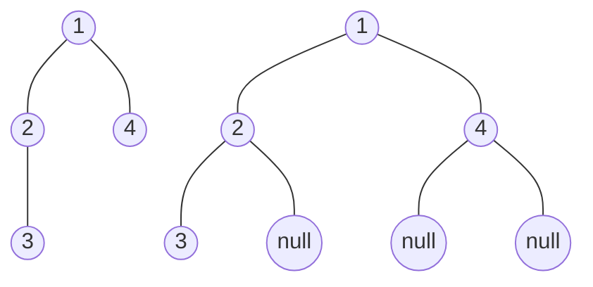
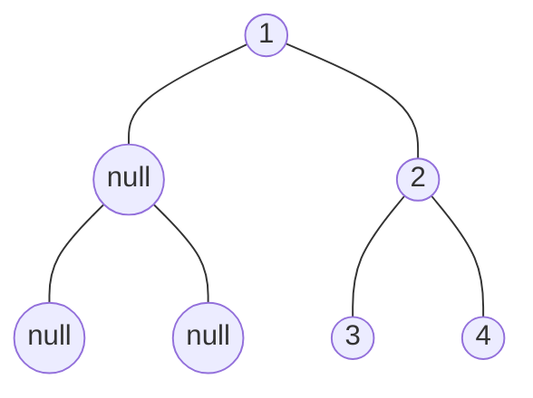

# 二叉树基础

## 1. 二叉树种类

**满二叉树**

树的所叶子结点在同一层，且其余节点的度都为 2。


深度为 $k$ 的二叉树一共有 $2^k-1$ 个节点。

**完全二叉树**

除了最后一层可以不用填满，其余每层节点都从左往右（不能中间隔一个空节点）填满。


满二叉树是完全二叉树

**二叉搜索树**

每个结点都有数值，且对于任意结点满足以下条件：

* 左子树不为空，则左子树上所有节点都小于该节点
* 右子树不为空，则右子树上所有节点都大于该节点


**平衡二叉搜索树（AVL 树）**

AVL 树在二叉搜索树的条件下，还需满足：根节点左右两个子树的高度差不能超过 1（防止二叉搜索树在极端情况退化为单链表）。


一旦增删操作后不平衡，则需要通过旋转来保持平衡。

**红黑树**

红黑树是一种弱 AVL 树，在每个节点增加一个存储位表示节点的颜色，红或者黑。通过任何一条从根到叶子的路径上各个结点着色方式的限制，红黑树确保没有一条路径会比其他路径长出俩倍，因而是接近平衡的。因此红黑树的旋转次数比 AVL 树的更少，在插入删除操作较多的情况下更优。

## 2. 二叉树的存储

### 链式存储


对节点定义如下

```cpp
struct TreeNode
{
    int val;
    TreeNode* left;
    TreeNode* right;
    TreeNode(int x) : val(x), left(nullptr), right(nullptr) {}
};
```

### 顺序存储

顺序存储适用于存储完全二叉树，如果树是完全二叉树则需要补全为完全二叉树，然后存储到数组。



对于顺序存储，结点的序号 i 有以下性质（根节点为 0 时）：

* 左子结点为 i * 2 + 1
* 右子结点为 i * 2 + 2


顺序存储的优点是实现简单，但是缺点也很明显：

* 不适合对树进行插入删除操作
* 树为非完全二叉树时会产生很多额外的内存开销

### 图存储（邻接矩阵）


## 4. 构建任意二叉树

### 4.1 链式存储

#### 直接徒手构建（dumb but easy）

```cpp
auto root = new TreeNode(0);
auto c1 = new TreeNode(-1);
auto c2 = new TreeNode(2);
auto c3 = new TreeNode(5);
auto c4 = new TreeNode(3);
auto c5 = new TreeNode(9);
root->left = c1; root->right = c2;
c1->left = c3; c1->right = c4;
c2->right = c5;
```

#### 利用顺序存储的数组构建

```cpp
//eg. {"1", "2", "3", "null", "null", "5", "6"};
TreeNode* createTree(vector<string>& nums)
{
    if (nums.empty()) return nullptr;
    
    vector<TreeNode*> nodes;
    TreeNode* root;
	
    // 创建所有结点
    for (const string& num: nums)
    {
        if (num != "null")
            nodes.push_back(new TreeNode(stoi(num)));
        else
            nodes.push_back(nullptr);
    }
	
    // 通过父子结点序号关系构建结点之间的连接
    root = nodes[0];
    for (int i = 0; i * 2 + 2 < nodes.size(); i++)
    {
        if (nodes[i] != nullptr)
        {
            nodes[i]->left = nodes[i * 2 + 1];
            nodes[i]->right = nodes[i * 2 + 2];
        }
    }

    return root;
}
```

#### 利用层序构建

当树的结构不是完全二叉树时，利用顺序数组的方法会比较占用空间，输入也十分繁琐。所以可以利用层序。

> LeetCode 的题目给出的举例就是层序的



| 顺序数组               | 层序数组     |
| ---------------------- | ------------ |
| 1 null 2 null null 3 4 | 1 null 2 3 4 |

```cpp
// TreeNode(const std::string& x) : val(std::stoi(x)), left(nullptr), right(nullptr) {}
TreeNode* createTree(vector<string> nodes)
{
    if (nodes.empty()) return nullptr;
    // 最后一个 null 被省略了就补上
    if (nodes.size() % 2 == 0)
        nodes.emplace_back("null");
    
    queue<TreeNode*> que;
    auto root = new TreeNode(nodes[0]);

    que.push(root);
    for (int i = 1; i < nodes.size(); i += 2)
    {
        TreeNode *node = que.front();
		
        // 加入左结点
        if (nodes[i] != "null")
        {
            node->left = new TreeNode(nodes[i]);
            que.push(node->left);
        }
		
        // 加入右结点
        if (nodes[i + 1] != "null")
        {
            node->right = new TreeNode(nodes[i + 1]);
            que.push(node->right);
        }

        que.pop();
    }

    return root;
}
```

### 4.2 图存储

树是没有环的连通图，所以我们当然可以使用表示图的数据结构来表示树。对于以边为单位输入的二叉树，使用图的方法来存储是最方便的。

此外如果是二叉树，则必须提前确定好具体是哪个结点为根节点。如下图所示：


可以表示为 `n=5, edges=[[1,2],[1,3],[2,4],[2,5]]` 以 1 为根节点。

#### 邻接矩阵

$$
\begin{bmatrix}
0&1&1&0&0\\
1&0&0&1&1\\
1&0&0&0&0\\
0&1&0&0&0\\
0&1&0&0&0
\end{bmatrix}
$$

```cpp
vector<vector<int>> createAdjacencyMatrix(vector<vector<int>>& edges)
{
    auto n = edges.size() + 1;
    // 因为结点序号从 1 开始所以大小为 n+1
    vector<vector<int>> matrix(n+1, vector<int>(n+1, 0));

    for (vector<int>& edge: edges)
        matrix[edge[0]][edge[1]] = matrix[edge[1]][edge[0]] = 1;

    return matrix;
}
```

#### 邻接表

可以看出，邻接矩阵表示一颗二叉树时，矩阵太稀疏了，会浪费很多空间。所以可以采用邻接表的方式来记录。


利用 C++ `vector` 容器可以很容易地实现邻接表。

```cpp
vector<vector<int>> createAdjacencyList(vector<vector<int>>& edges)
{
    auto n = edges.size() + 1;
    vector<vector<int>> list(n+1);

    for (vector<int>& edge: edges)
    {
        list[edge[0]].emplace_back(edge[1]);
        // 如果约定 edge[0] 是父结点 edge[1] 是子结点,
        // 且 edges 按照先左后右排序，则不需要下面这行代码
        list[edge[1]].emplace_back(edge[0]);
    }

    return list;
}
```

## 3. 二叉树的遍历

### 3.1 链式存储二叉树遍历

针对链式存储的二叉树，遍历的方式来看有：

* 深度优先（递归，迭代）
  * 前序遍历：中左右
  * 中序遍历：左中右
  * 后序遍历：左右中
* 广度优先（迭代）
  * 层序遍历


| 遍历顺序 | 结果          |
| -------- | ------------- |
| 前序遍历 | 1 2 4 5 3 6 7 |
| 中序遍历 | 4 2 5 1 6 3 7 |
| 后序遍历 | 4 5 2 6 7 3 1 |
| 层序遍历 | 1 2 3 4 5 6 7 |

#### 深度优先

##### 前序

**递归法**

```cpp
void traversal(TreeNode* node, vector<int>& res)
{
    if (node == nullptr) return;

    res.emplace_back(node->val); // 中
    traversal(node->left, res);  // 左
    traversal(node->right, res); // 右
}
```

**迭代法**

```cpp
vector<int> preorderTraversal(TreeNode* root)
{    
    vector<int> res;
    stack<TreeNode*> stk;

	if (root) stk.push(root);	// 空指针判定很重要！！！！！！！！！！

    while (!stk.empty())
    {
        TreeNode* tmp = stk.top();
        stk.pop();
        res.push_back(tmp->val);
        
        // 栈是先进后出，所以右要先进栈
        if (tmp->right) stk.push(tmp->right);
        if (tmp->left) stk.push(tmp->left);
    }

    return res;
}

```

##### 中序

**递归法**

```cpp
void traversal(TreeNode* cur, vector<int>& res)
{
    if (cur == nullptr) return;

    traversal(cur->left, res);  // 左
    res.emplace_back(cur->val); // 中
    traversal(cur->right, res); // 右
}
```

**迭代法**

中序遍历在迭代法中，对节点的访问和处理是不一致的。

```cpp
vector<int> inorderTraversal(TreeNode* root)
{
    vector<int> res;
    stack<TreeNode*> stk;

    TreeNode* cur = root;
    while (cur || !stk.empty())
    {
        if (cur)
        {
            // 不断将左子节点入栈
            stk.push(cur);
            cur = cur->left;
        }
        else
        {
            // 取出栈顶节点，记录值，右子节点入栈
            cur = stk.top();
            stk.pop();
            res.emplace_back(cur->val);
            cur = cur->right;
        }
    }

    return res;
}
```

##### 后序

**递归法**

```cpp
void traversal(TreeNode* cur, vector<int>& res)
{
    if (cur == nullptr) return;

    traversal(cur->left, res);  // 左
    traversal(cur->right, res); // 右
    res.emplace_back(cur->val); // 中
}
```

**迭代法**


```cpp
vector<int> postorderTraversal(TreeNode* root)
{
    vector<int> res;
    stack<TreeNode*> stk;
    if (root) stk.push(root);	// 空指针判定很重要！！！！！！！！！！

    while (!stk.empty())
    {
        TreeNode* cur = stk.top();
        stk.pop();
        res.emplace_back(cur->val);

        if (cur->left) stk.push(cur->left);
        if (cur->right) stk.push(cur->right);
    }
    reverse(res.begin(), res.end());
    return res;
}
```

#### 广度优先

##### 层序

**迭代法**

```cpp
// 顺序输出
vector<int> levelOrderTraversal(TreeNode* root)
{
    vector<int> res;
    queue<TreeNode*> que;
    if (root) que.push(root);	// 空指针判定很重要！！！！！！！！！！

    while (!que.empty())
    {
        TreeNode* cur = que.front();
        res.push_back(cur->val);

        if (cur->left) que.push(cur->left);
        if (cur->right) que.push(cur->right);

        que.pop();
    }

    return res;
}

// 分层输出
vector<vector<int>> levelOrder(TreeNode* root)
{
    vector<vector<int>> res;
    queue<TreeNode*> que;
    if (root) que.push(root);	// 空指针判定很重要！！！！！！！！！！

    while (!que.empty())
    {
        vector<int> nodes;
        
        int cnt = que.size(); // 记录当前层的结点数用于遍历
        for (int i = 0; i < cnt; i++)
        {
            TreeNode* node = que.front();
            nodes.emplace_back(node->val);
            
            if (node->left) que.push(node->left);
            if (node->right) que.push(node->right);
            
            que.pop();
        }
        res.emplace_back(nodes);
    }

    return res;
}
```

**递归法**

递归法需要通过深度参数 `depth` 来表示当前结点的深度。

```cpp
void recursion(TreeNode* cur, vector<vector<int>>& res, int depth)
{
    if (!cur) return;
	
    // 下标从 0 开始计算，所以是 size 等于 depth
    if (res.size() == depth) res.emplace_back();
    res[depth].emplace_back(cur->val);

    recursion(cur->left, res, depth + 1);
    recursion(cur->right, res, depth + 1);
}

vector<vector<int>> recursionLeveOrder(TreeNode* root)
{
    vector<vector<int>> res;

    recursion(root, res, 0);

    return res;
}
```

### 前中后序迭代统一写法

该方法在每个当前操作的节点前都加入一个空指针，这样能够通过判定有空指针则弹出该结点并计入结果中。

```cpp
vector<int> traversal(TreeNode* root)
{
    vector<int> res;
    stack<TreeNode*> stk;
	
    if (root) stk.push(root);	// 空指针判定很重要！！！！！！！！！！

    while (!stk.empty())
    {
        TreeNode* cur = stk.top();

        if (cur)
        {
            stk.pop();

            if (cur->right) stk.push(cur->right); // 右
            if (cur->left) stk.push(cur->left);   // 左
            stk.push(cur);                        // 中
            stk.push(nullptr);                    // 空指针标记
        }
        else
        {
            stk.pop(); // 先弹出空指针
            res.emplace_back(stk.top()->val);
            stk.pop();
        }
    }

    return res;
}
```

### 3.2 邻接表遍历

如果输入没有保证左右顺序以及父子结点顺序。

```cpp
void dfs(int cur, int pre, vector<vector<int>>& graph, vector<int>& res)
{
    res.emplace_back(cur);	// 中

    // 遍历子树，左右顺序得提前约定
    for (int i = 0; i < graph[cur].size(); i++)
    {
        int next = graph[cur][i];
        // 如果是父结点则跳过
        if (next == pre)
            continue;
        dfs(next, cur, graph, res);
    }
}
```

如果约定 `edge[0]` 是父结点 `edge[1]` 是子结点，且 `edges` 按照先左后右排序。

```cpp
vector<vector<int>> createAdjacencyList(vector<vector<int>>& edges)
{
    auto n = edges.size() + 1;
    vector<vector<int>> list(n+1);

    for (vector<int>& edge: edges)
    {
        list[edge[0]].emplace_back(edge[1]);
        // 如果约定 edge[0] 是父结点 edge[1] 是子结点,
        // 且 edges 按照先左后右排序，则不需要下面这行代码
        // list[edge[1]].emplace_back(edge[0]);
    }

    return list;
}

void dfs(int cur, vector<vector<int>>& graph, vector<int>& res)
{
    res.emplace_back(cur);	// 中

    if (!graph[cur].empty())
        dfs(graph[cur][0], graph, res); // 左
    if (graph[cur].size() > 1)
        dfs(graph[cur][1], graph, res); // 右
}
```

