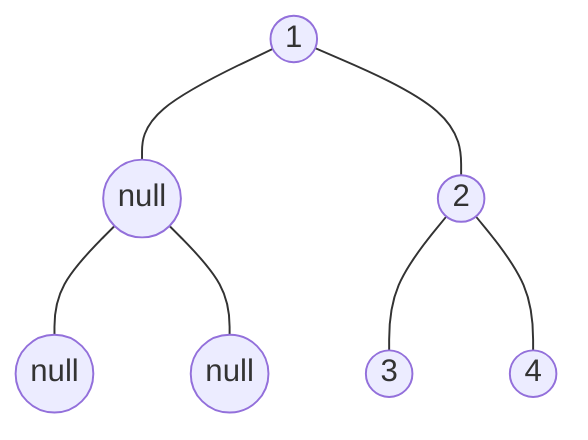

# 二叉树基础

## 1. 二叉树种类

**满二叉树**

树的所叶子结点在同一层，且其余节点的度都为 2。


深度为 $k$ 的二叉树一共有 $2^k-1$ 个节点。

**完全二叉树**

除了最后一层可以不用填满，其余每层节点都从左往右（不能中间隔一个空节点）填满。


满二叉树是完全二叉树

**二叉搜索树**

每个结点都有数值，且对于任意结点满足以下条件：

* 左子树不为空，则左子树上所有节点都小于该节点
* 右子树不为空，则右子树上所有节点都大于该节点


**平衡二叉搜索树（AVL 树）**

AVL 树在二叉搜索树的条件下，还需满足：根节点左右两个子树的高度差不能超过 1（防止二叉搜索树在极端情况退化为单链表）。


一旦增删操作后不平衡，则需要通过旋转来保持平衡。

**红黑树**

红黑树是一种弱 AVL 树，在每个节点增加一个存储位表示节点的颜色，红或者黑。通过任何一条从根到叶子的路径上各个结点着色方式的限制，红黑树确保没有一条路径会比其他路径长出俩倍，因而是接近平衡的。因此红黑树的旋转次数比 AVL 树的更少，在插入删除操作较多的情况下更优。

## 2. 二叉树的存储

### 链式存储


对节点定义如下

```cpp
struct TreeNode
{
    int val;
    TreeNode* left;
    TreeNode* right;
    TreeNode(int x) : val(x), left(nullptr), right(nullptr) {}
};
```

### 顺序存储

顺序存储适用于存储完全二叉树，如果树是完全二叉树则需要补全为完全二叉树，然后存储到数组。


对于顺序存储，结点的序号 i 有以下性质（根节点为 0 时）：

* 左子结点为 i * 2 + 1
* 右子结点为 i * 2 + 2


顺序存储的优点是实现简单，但是缺点也很明显：

* 不适合对树进行插入删除操作
* 树为非完全二叉树时会产生很多额外的内存开销

## 3. 二叉树的遍历

遍历的方式来看有：

* 深度优先（递归，迭代）
  * 前序遍历：中左右
  * 中序遍历：左中右
  * 后序遍历：左右中
* 广度优先（迭代）
  * 层序遍历


| 遍历顺序 | 结果          |
| -------- | ------------- |
| 前序遍历 | 1 2 4 5 3 6 7 |
| 中序遍历 | 4 2 5 1 6 3 7 |
| 后序遍历 | 4 5 2 6 7 3 1 |
| 层序遍历 | 1 2 3 4 5 6 7 |

## 4. 构建任意二叉树

### 利用顺序存储数组构建

```cpp
//eg. {"1", "2", "3", "null", "null", "5", "6"};
TreeNode* createTree(vector<string>& nums)
{
    if (nums.empty()) return nullptr;
    
    vector<TreeNode*> nodes;
    TreeNode* root;
	
    // 创建所有结点
    for (const string& num: nums)
    {
        if (num != "null")
            nodes.push_back(new TreeNode(stoi(num)));
        else
            nodes.push_back(nullptr);
    }
	
    // 通过父子结点序号关系构建结点之间的连接
    root = nodes[0];
    for (int i = 0; i * 2 + 2 < nodes.size(); i++)
    {
        if (nodes[i] != nullptr)
        {
            nodes[i]->left = nodes[i * 2 + 1];
            nodes[i]->right = nodes[i * 2 + 2];
        }
    }

    return root;
}
```

### 利用层序构建

当树的结构不是完全二叉树时，利用顺序数组的方法会比较占用空间，输入也十分繁琐。所以可以利用层序。

> LeetCode 的题目给出的举例就是层序的



| 顺序数组               | 层序数组     |
| ---------------------- | ------------ |
| 1 null 2 null null 3 4 | 1 null 2 3 4 |

```cpp
TreeNode* createTree(vector<string> nodes)
{
    if (nodes.empty()) return nullptr;
    // 最后一个 null 被省略了就补上
    if (nodes.size() % 2 == 0)
        nodes.emplace_back("null");
    
    queue<TreeNode*> que;
    auto root = new TreeNode(stoi(nodes[0]));

    que.push(root);
    for (int i = 1; i < nodes.size(); i += 2)
    {
        TreeNode* p = que.front();
        TreeNode* node;
        
        // 加入左子结点
        if (nodes[i] != "null")
        {
            node = new TreeNode(stoi(nodes[i]));
            p->left = node;
            que.push(node);
        }
		
        // 加入右子节点
        if (nodes[i + 1] != "null")
        {
            node = new TreeNode(stoi(nodes[i + 1]));
            p->right = node;
            que.push(node);
        }

        que.pop();
    }

    return root;
}
```

