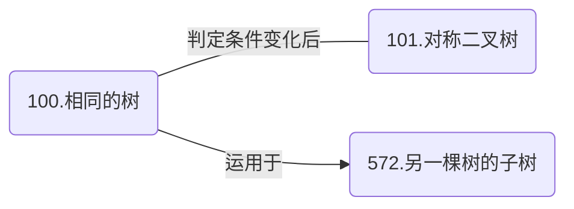

# 二叉树

## 单二叉树遍历

### [199. 二叉树的右视图（Medium）](https://leetcode.cn/problems/binary-tree-right-side-view/)

#### 广度优先

层序遍历找最右结点

```cpp
vector<int> rightSideView(TreeNode* root)
{
    vector<int> res;
    queue<TreeNode*> que;
    if (root) que.push(root); // 空指针判定很重要！！！！！！！！！！

    while (!que.empty())
    {
        TreeNode* cur;
        int size = que.size();
        int last = 0;

        while (size--)
        {
            cur = que.front();
            last = cur->val;
            if (cur->left) que.push(cur->left);
            if (cur->right) que.push(cur->right);
            que.pop();
        }

        res.push_back(last);
    }

    return res;
}
```

#### 深度优先

每层先访问右节点，记录每层遇到的第一个节点即为最右结点。

```cpp
void dfs(TreeNode* cur, vector<int>& res, int depth)
{
    if (!cur) return;

    if (res.size() == depth) res.emplace_back(cur->val);

    dfs(cur->right, res, depth + 1);
    dfs(cur->left, res, depth + 1);
}
```

#### 类似题目

[637. 二叉树的层平均值（Easy）](https://leetcode.cn/problems/average-of-levels-in-binary-tree/)

[513. 找树左下角的值（Medium）](https://leetcode.cn/problems/find-bottom-left-tree-value/)

### [515. 在每个树行中找最大值（Medium）](https://leetcode.cn/problems/find-largest-value-in-each-tree-row/)

#### 深度优先

```cpp
void dfs(vector<int>& res, TreeNode* cur, int depth)
{
    if (!cur) return;

    if (res.size() == depth)
        res.emplace_back(cur->val);
    else
        res[depth] = max(cur->val, res[depth]);

    dfs(res, cur->left, depth + 1);
    dfs(res, cur->right, depth + 1);
}
```

#### 广度优先

```cpp
vector<int> bfs(TreeNode* root)
{
    vector<int> res;
    queue<TreeNode*> que;

    if (root) que.push(root);

    while (!que.empty())
    {
        int size = que.size();
        int m = INT_MIN;
        while (size--)
        {
            TreeNode* cur = que.front();
            que.pop();
            if (cur->val > m) m = cur->val;

            if (cur->left) que.push(cur->left);
            if (cur->right) que.push(cur->right);
        }

        res.push_back(m);
    }

    return res;
}
```

### [104. 二叉树的最大深度（Easy）](https://leetcode.cn/problems/maximum-depth-of-binary-tree/)

#### 深度优先

```cpp
void dfs(TreeNode* cur, int& res, int depth)
{
    if (!cur) return;

    res = max(res, depth)

    dfs(cur->left, res, depth + 1);
    dfs(cur->right, res, depth + 1);
}

int maxDepth(TreeNode* root)
{
    int res = 0;
    dfs(root, res, 1);
    return res;
}
```

#### 广度优先

```cpp
int bfs(TreeNode* root)
{
    int res = 0;
    queue<TreeNode*> que;

    if (root) que.push(root);

    while (!que.empty())
    {
        int size = que.size();

        while (size--)
        {
            TreeNode* cur = que.front();
            que.pop();
            if (cur->left) que.push(cur->left);
            if (cur->right) que.push(cur->right);
        }

        res++;
    }

    return res;
}
```

### [111. 二叉树的最小深度（Easy）](https://leetcode.cn/problems/minimum-depth-of-binary-tree/)

最小深度即为第一次遇到节点左右孩子都为空。

#### 深度优先

```cpp
// dfs(root, res, 1);
void dfs(TreeNode* cur, int& res, int depth)
{
    if (!cur)
    {
        res = min(depth, res);
        return;
    }

    if (!cur->left && !cur->right)
        res = min(depth, res);

    dfs(cur->left, res, depth + 1);
    dfs(cur->right, res, depth + 1);
}
```

#### 广度优先

```cpp
int bfs(TreeNode* root)
{
    int res = 0;
    queue<TreeNode*> que;
    if (root) que.push(root);

    while (!que.empty())
    {
        int size = que.size();
        res++;
        while (size--)
        {
            TreeNode* cur = que.front();
            que.pop();
            if (!cur->left && !cur->right)
                return res;

            if (cur->left) que.push(cur->left);
            if (cur->right) que.push(cur->right);
        }
    }

    return res;
}
```

### [116. 填充每个节点的下一个右侧节点指针（Medium）](https://leetcode.cn/problems/populating-next-right-pointers-in-each-node/)

#### 层序连接

```cpp
Node* connect(Node* root)
{
    queue<Node*> que;
    if (root) que.push(root);

    while (!que.empty())
    {
        int size = que.size();

        for (int i = 0; i < size; i++)
        {
            Node* cur = que.front();
            que.pop();
			
            // 每层最后一个结点不连接
            if (i < size - 1)
                cur->next = que.front();

            if (cur->left) que.push(cur->left);
            if (cur->right) que.push(cur->right);
        }
    }

    return root;
}
```

因为需要额外的队列空间来维护结点，所以空间复杂度为 $O(n)$

#### 依靠 next 指针遍历

每层都提前将下层的结点向右连接起来，之后到下一层只需通过 next 遍历，不需要额外的队列空间。空间复杂度 $O(1)$

```cpp
Node* connect(Node* root)
{
    if (!root) return nullptr;

    Node* level = root;

    while (level)
    {
        Node* cur = level;
        while (cur)
        {
            // 左子结点指向右子结点
            cur->left->next = cur->right;
            // 右子结点指向邻近兄弟节点
            if (cur->next)
            	cur->right->next = cur->next->left;

            cur = cur->next;
        }

        level = level->left;
    }
    return root;
}
```

### [117. 填充每个节点的下一个右侧节点指针 II（Medium）](https://leetcode.cn/problems/populating-next-right-pointers-in-each-node-ii/)

这道题是 116 的进阶版，树不再是 **完美/满二叉树** 。对于广度优先来说和 116 没有任何区别，不过想要做到空间复杂度为 $O(1)$ ，处理方法和 116 还是有些许不同。

#### 麻烦办法：不引入 dummy 结点

```cpp
Node* connect(Node* root)
{
    if (!root) return nullptr;

    Node* level = root;

    while (level)
    {
        Node* cur = level;
        Node* pre = nullptr;
        // 为下层连接 next
        while (cur)
        {
            if (cur->left)
            {
                // 如果 pre 不为空，说明存在上一个需要连接的结点
                if (pre) pre->next = cur->left;
                pre = cur->left;
            }
            if (cur->right)
            {
                if (pre) pre->next = cur->right;
                pre = cur->right;
            }

            cur = cur->next;
        }
		
        // 寻找下层起始结点
        while (level)
        {
            if (level->left)
            {
                level = level->left;
                break;
            }

            if (level->right)
            {
                level = level->right;
                break;
            }
			
            // 当前结点左右为空，则寻找 next 的左右结点
            level = level->next;
        }
    }

    return root;
}
```

#### 引入 dummy 结点

```cpp
Node* connect(Node* root)
{
    if (!root) return nullptr;

    Node* cur = root;
    Node* dummy = new Node(0);

    while (cur)
    {
        // dummy 每层开始必须置为空防止无限循环最后一层
        dummy->next = nullptr;
        Node* pre = dummy;

        while (cur)
        {
            if (cur->left)
            {
                pre->next = cur->left;
                pre = pre->next;
            }
            if (cur->right)
            {
                pre->next = cur->right;
                pre = pre->next;
            }

            cur = cur->next;
        }

        cur = dummy->next;
    }

    return root;
}
```

### [110. 平衡二叉树（Easy）](https://leetcode.cn/problems/balanced-binary-tree/)

一颗平衡二叉树其每个节点的左右子树高度差不超过 1。所以我们需要对输入的二叉树每个节点的左右子树高度进行计算。

#### 计算左右子树高度

需要先计算当前结点的高度就需要先知道左右子树的高度，所以需要使用后序。

```cpp
int treeHeight(TreeNode* cur)
{
    // 空树高度为 0
    if (!cur) return 0;
	
    int hL = treeHeight(cur->left);
    int hR = treeHeight(cur->right);
	
    // 高度为 -1 说明子树不符合平衡
    if (hL == -1 || hR == -1) return -1; 
	
    // 计算左右子树高度差是否平衡
    if (abs(hL - hR) > 1) return -1;
	
    // 当前结点高度 = 左右子树最大高度 + 1
    return max(hL, hR) + 1;
}

bool isBalanced(TreeNode* root)
{
    return treeHeight(root) != -1;
}
```

#### 计算左右最大深度

计算深度的时候不会出现 0 - (-1) 或 -1 - 0 的情况，所以可以不用判断左右最大深度返回值是否为 -1

```cpp
int treeDepth(TreeNode* cur, int depth)
{
    // 结点为空则当前深度需要减一
    if (!cur) return depth - 1;
	
    int dL = treeDepth(cur->left, depth + 1);
    int dR = treeDepth(cur->right, depth + 1);
    
   	// 左右子树最大深度差大于 1 则不平衡
    if (abs(dL - dR) > 1) return -1;

    return max(dL, dR);
}

bool isBalanced(TreeNode* root)
{
    return treeDepth(root, 1) != -1;
}
```

### [257. 二叉树的所有路径（Easy）](https://leetcode.cn/problems/binary-tree-paths/)

改题需要输出二叉树的路径，所以我们除去存储每个路径的数组外，还需要一个 `string` 变量来存储路径的值。

在本题中，`->` 是一个较为麻烦的处理点。如果每个结点之后跟随一个 `->` 则需要再最后一个结点添加判断，或者在根结点分开，如下所示。

```cpp
void path(TreeNode* cur, vector<string>& res, string p)
{
    if (!cur) return;
	
    // 中：添加当前结点到路径中
    p += "->" + to_string(cur->val);

    if (!cur->left && !cur->right) res.emplace_back(p);

    path(cur->left, res, p);
    path(cur->right, res, p);
}

vector<string> binaryTreePaths(TreeNode* root)
{
    vector<string> res;
    if (!root->left && !root->right) return {{to_string(root->val)}};
    path(root->left, res, to_string(root->val));
    path(root->right, res, to_string(root->val));
    return res;
}
```

但是还有一个更简介的办法，就是利用回溯的特点，如下：

```cpp
void path(TreeNode* cur, vector<string>& res, string p)
{
    if (!cur) return;
	
    // 中：添加当前结点到路径中
    p += to_string(cur->val);
	
    // 当前结点为叶子，则找到一条路径，存储到 res 中并返回
    if (!cur->left && !cur->right)
    {
        res.emplace_back(p);
        return;
    }
	
    // 继续向左右子树更新路径
    // 把 -> 作为一个可回溯的值
    // 这样可以避免处理最后一个结点多出来的 ->
    path(cur->left, res, p + "->");
    path(cur->right, res, p + "->");
}

vector<string> binaryTreePaths(TreeNode* root)
{
    vector<string> res;
    path(root, res, "");
    return res;
}
```

### [113. 路径总和 II（Medium）](https://leetcode.cn/problems/path-sum-ii/)

该题需要找到一棵二叉树中所有路径和为 `targetSum` 的路径，并输出。因此我们需要在遍历一棵树的同时，记录路径和和结点的值。为了正确获得路径顺序，应该使用前序。

```cpp
vector<vector<int>> res;
vector<int> tmpPath;

void path(TreeNode* cur, int target)
{
    if (!cur) return;
	
    // 中：存储当前结点的值
    tmpPath.emplace_back(cur->val);
	
    // 注意叶子结点的条件
    if (target == cur->val && !cur->left && !cur->right)
        res.emplace_back(tmpPath);
	
    path(cur->left, target - cur->val);		// 左
    path(cur->right, target - cur->val);	// 右
    tmpPath.pop_back(); // 回溯
}

vector<vector<int>> pathSum(TreeNode* root, int targetSum)
{
    path(root, targetSum);
    return res;
}
```

####  相关题目

[112. 路径总和（Easy）](https://leetcode.cn/problems/path-sum/)

## 同时遍历两颗树

100、101、572 这三道题是层层递进的关系。



### [100. 相同的树（Easy）](https://leetcode.cn/problems/same-tree/)

该题需要对传入的两颗树的每个节点比较是否相等。所以需要同时遍历两颗树。然后比较两颗树的左右子结点。

#### 递归法

```cpp
bool isSame(TreeNode* a, TreeNode* b)
{
    // 两个节点都为空，自然相同
    if (!a && !b) return true;
    // 其一为空，则说明不相同
    if (!a || !b) return false;
    // 值不相等，则说明不同
    if (a->val != b->val) return false;
	
    // 左相同 && 右相同
    return isSame(a->left, b->left) && isSame(a->right, b->right);
}
```

#### 迭代法

```cpp
bool isSameIteration(TreeNode* a, TreeNode* b)
{
    queue<TreeNode*> que;
    que.push(a);
    que.push(b);
    
    while (!que.empty())
    {
        TreeNode* curA = que.front(); que.pop();
        TreeNode* curB = que.front(); que.pop();
        
        if (!curA && !curB) continue;
        if (!curA || !curB) return false;
        if (curA->val != curB->val) return false;
        
        que.push(curA->left);
        que.push(curB->left);
        que.push(curA->right);
        que.push(curB->right);
    }
    
    return true;
}
```

### [101. 对称二叉树（Easy）](https://leetcode.cn/problems/symmetric-tree/)

要判断一棵树是否轴对称，需要从外到内（内到外）判断两颗子树是否对称。即判断：

* left->left 和 right->right
* left->right 和 right->left

以下几种情况则说明不对称：

* 两者之一为空
* 两者值不相等
* 两者的子树不对称

换句话说，满足以下条件则说明对称：

* 两者都为空
* 两者值相等 且 两者的子树对称

#### 递归法

```cpp
bool compare(TreeNode* left, TreeNode* right)
{
    if (!left && !right) return true;
    if (!left || !right) return false;

    bool outside = compare(left->left, right->right);
    bool inside = compare(left->right, right->left);
	
    // 值 && 外 && 内
    return left->val == right->val && outside && inside;
}
```

#### 迭代法

```cpp
bool compareIteration(TreeNode* root)
{
    queue<TreeNode*> que;

    que.push(root->left);
    que.push(root->right);

    while (!que.empty())
    {
        TreeNode* left = que.front();
        que.pop();
        TreeNode* right = que.front();
        que.pop();

        if (!left && !right) continue;
        if (!left || !right) return false;
        if (left->val != right->val) return false;

        que.push(left->left);
        que.push(right->right);
        que.push(left->right);
        que.push(right->left);
    }

    return true;
}
```

### [572. 另一棵树的子树（Easy）](https://leetcode.cn/problems/subtree-of-another-tree/)

改题需要我们在一棵树中寻找是否存在与目标相同的子树。这与 [100. 相同的树](#相同的树easy) 的不同之处主要在于，进行比较的两棵树其中之一变为了一棵树的子树。

因此我们需要先确定子树的根节点，如果这课子树不满足，则需要找到下一颗子树进行比较。所以这个问题涉及到了两次递归（或多层迭代循环）。

#### 递归法

**子树是否相同判断**

这里与 [100. 相同的树](#相同的树easy) 并无差异。

```cpp
bool isSameTree(TreeNode* cur, TreeNode* subCur)
{
    if (!cur && !subCur) return true;
    if (!cur || !subCur) return false;
    if (cur->val != subCur->val) return false;

    return isSameTree(cur->left, subCur->left) && isSameTree(cur->right, subCur->right);
}
```

**遍历树种的子树**

```cpp
bool isSubtree(TreeNode* cur, TreeNode* subRoot)
{
    if (!cur) return false;
    // 判断以该结点为根的子树是否与目标相同
    if (isSameTree(cur, subRoot)) return true;
	
    // 继续向下寻找左子树和右子树
    return isSubtree(cur->left, subRoot) || isSubtree(cur->right, subRoot);
}
```


## 利用二叉树性质

### [222. 完全二叉树的节点个数](https://leetcode.cn/problems/count-complete-tree-nodes/)

直接通过递归或者迭代遍历一棵树也可以得到其结点个数，其时间复杂度为 $O(n)$ 。

```cpp
int countNodes(TreeNode* cur)
{
    if (!cur) return 0;
	
    // 左结点数 + 右结点数 + 当前结点
    return countNodes(cur->left) + countNodes(cur->right) + 1;
}
```

但是这道题的数是完全二叉树，我们可以利用其特性加快结点数量的计算。

一颗完全二叉树，除了最后一行的结点可以有空节点，其余每行都是填满的。这意味着，一颗完全二叉树的子树也是完全二叉树，而且有两种情况。


* **满二叉树**：这样可以通过树的高度直接通过公式 $2^h-1$ 算出其结点数。
* **普通完全二叉树**：左右子树结点数之和。

判断一颗完全二叉树是否为满二叉树，可以利用以下性质：

* 对于一颗完全二叉树，分别遍历最左和最右的高度
  * 若相等，则该树为满二叉树；

```cpp
int count(TreeNode* cur)
{
    if (!cur) return 0;
	
    // 根节点高度为 1
    int cntL = 1, cntR = 1;
    TreeNode *tmp = cur->left;

    while (tmp)
    {
        tmp = tmp->left;
        cntL++;
    }
    tmp = cur->right;
    while (tmp)
    {
        tmp = tmp->right;
        cntR++;
    }
	
    // 1 << 1 = 2^1
    if (cntL == cntR) return (1 << cntL) - 1;

    return count(cur->left) + count(cur->right) + 1;
}
```

